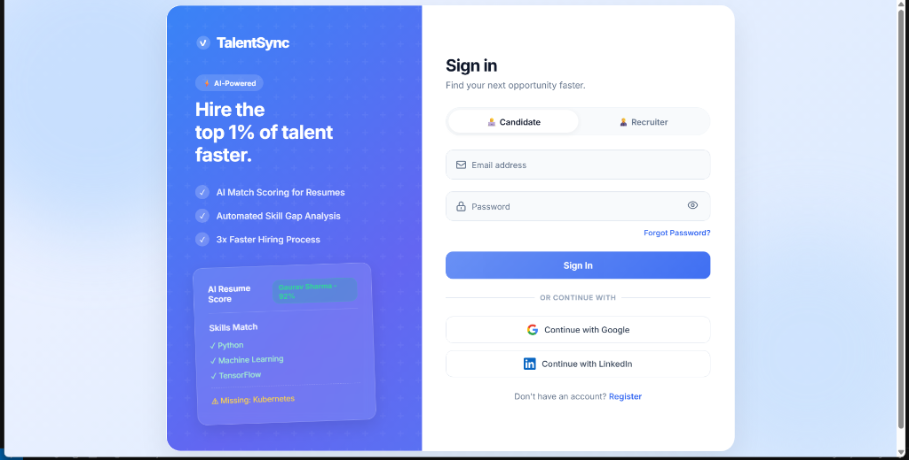
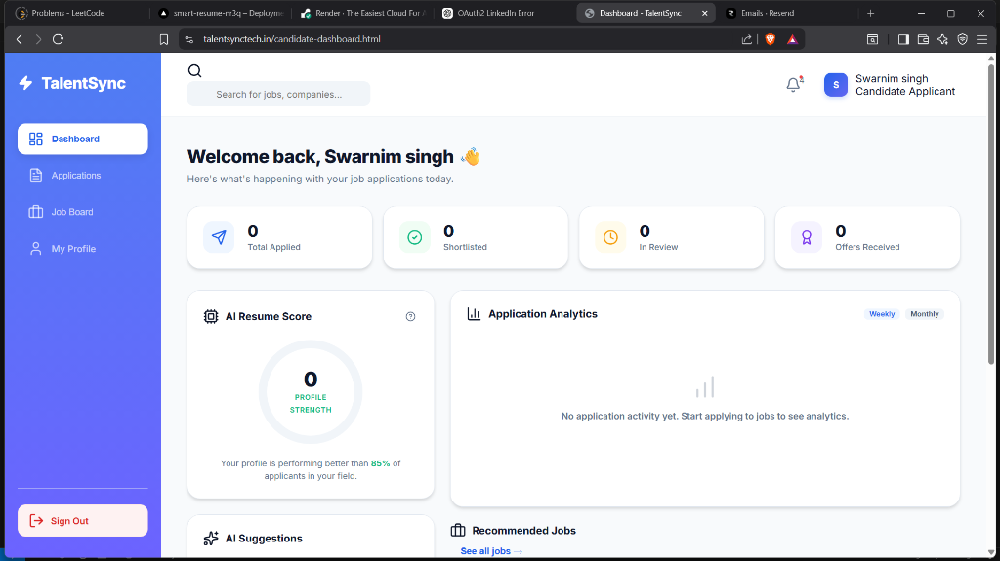
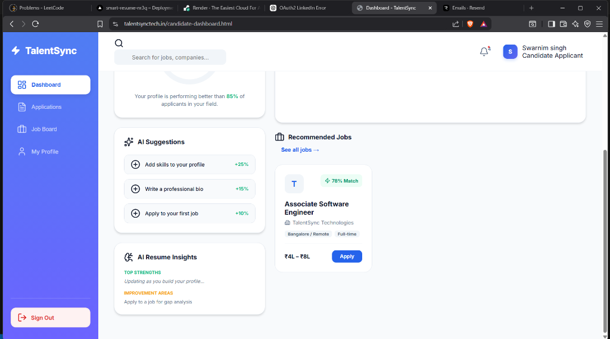
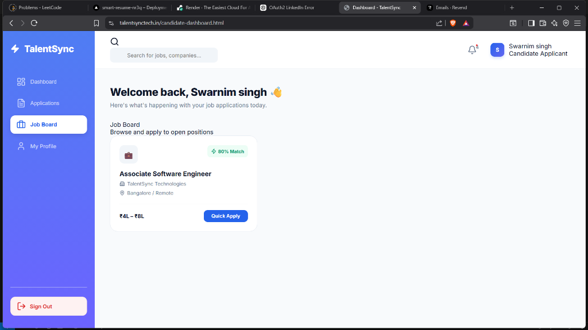
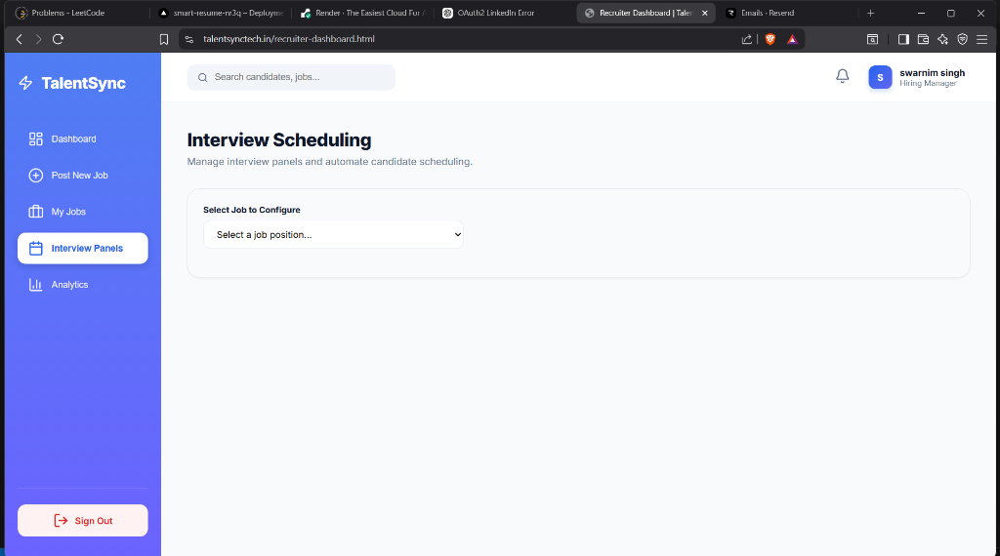
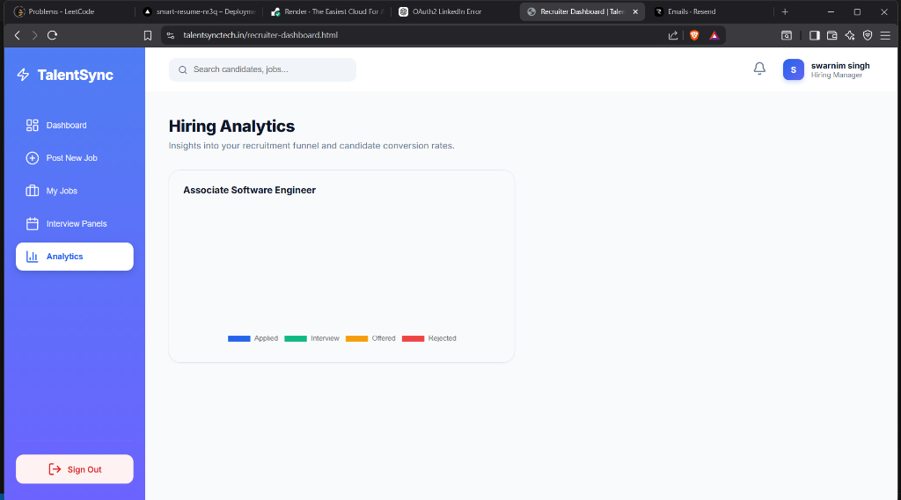
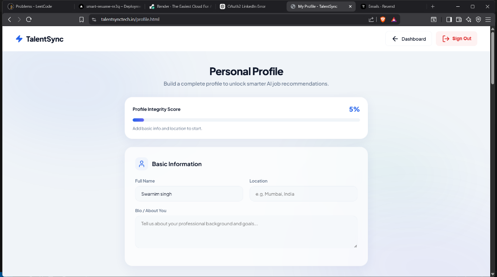
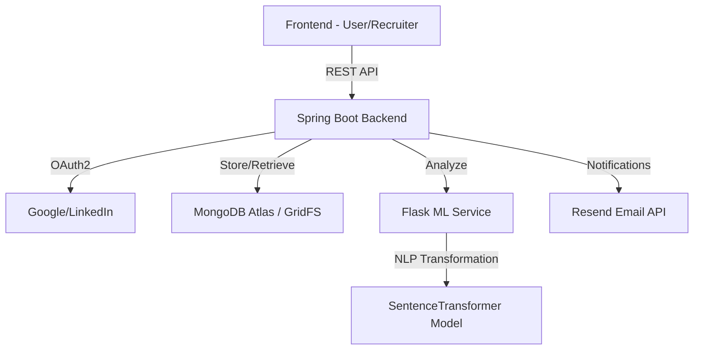

# TalentSync - AI-Powered Resume Screening & Recruitment

 

**TalentSync** is a full-stack AI recruitment platform that automates resume screening and candidate matching using modern NLP models.

## 🔗 Live Demo
Check out the live platform: [talentsynctech.in](https://www.talentsynctech.in)

---

## 📸 Screenshots

### Sign-In Portal


### Candidate Dashboard


### Resume Match Insights


### AI-Driven Job Board


### Recruiter Dashboard


### Intelligent Job Posting & Pipeline


### Interview Scheduling & Analytics



### Comprehensive Profile & Resume Management



---

## 🚀 Key Features

### For Candidates
*   **AI Resume Analysis**: Instant feedback on how well your resume matches a job description.
*   **Skills Gap Analysis**: Pinpoint exactly which technical and soft skills you're missing for a target role.
*   **Smart Recommendations**: Automated course suggestions (from Coursera, Udemy, etc.) to help you upskill.
*   **Role Prediction**: AI-powered prediction of your most likely job role based on your experience.

### For Recruiters
*   **Automated Candidate Ranking**: Bulk process resumes and rank candidates based on a multi-factor match score.
*   **Deep Semantic Matching**: Uses SentenceTransformers (SOTA NLP) to understand context beyond simple keywords.
*   **Candidate Insights**: View detailed extracted profiles including detected experience, skills, and match confidence.

---

## 🛠️ Technology Stack

| Component | Technology |
| :--- | :--- |
| **Backend** | Java 21, Spring Boot 3.1.4, Spring Security, JWT, OAuth2 (Google/LinkedIn) |
| **ML Microservice** | Python 3.10+, Flask, SentenceTransformers (`all-MiniLM-L6-v2`), PyTorch |
| **Database** | MongoDB Atlas (GridFS for resume storage, Mongo Sync for metadata) |
| **Frontend** | HTML5, CSS3 (Glassmorphism), Vanilla JavaScript, Google Fonts |
| **Infrastructure** | Docker, Jenkins/Render/Vercel Support, Resend (Email API) |

---

## 📐 System Architecture



---

## 📂 Project Structure

```text
talentsync/
├── smart-resume-backend/
├── src/main/java/
│   ├── controller/
│   ├── service/
│   ├── model/
│   └── security/
└── src/main/resources/
    └── static/
        ├── candidate-dashboard.html
        ├── recruiter-dashboard.html
        └── profile.html
├── ml-service/
│   ├── app.py
│   ├── ml_logic.py
│   └── requirements.txt
├── docs/
│   └── screenshots/
└── README.md
```

---

## 🛠️ Installation & Setup

### Prerequisites
*   Java 21 & Maven
*   Python 3.10+
*   MongoDB Atlas Account
*   Resend API Key (for emails)

### 1. ML Microservice Setup
```bash
cd ml-service
python -m venv venv
source venv/bin/activate  # On Windows: venv\Scripts\activate
pip install -r requirements.txt
python app.py
```

### 2. Backend Setup
Create an `application.properties` or set environment variables:
```properties
MONGODB_URI=your_mongodb_uri
JWT_SECRET=your_32_char_secret
GOOGLE_CLIENT_ID=your_id
GOOGLE_CLIENT_SECRET=your_secret
RESEND_API_KEY=your_key
ML_SERVICE_URL=http://localhost:5000
```
Run the application:
```bash
mvn clean package
mvn spring-boot:run
```

---

## 🔐 Security

TalentSync uses modern authentication mechanisms:
*   **JWT Based Authentication**: Secure stateless session management.
*   **OAuth2 Login**: Seamless integration with Google and LinkedIn.
*   **Role-Based Access Control (RBAC)**: Distinct permissions for Candidates, Recruiters, and Admins.
*   **Secure Password Hashing**: Industry-standard encryption via Spring Security.

---

## 🔗 API Documentation (Key Endpoints)

| Endpoint | Method | Description |
| :--- | :--- | :--- |
| `/api/auth/signup` | POST | Register as Candidate or Recruiter |
| `/api/auth/signin` | POST | Authenticate and receive JWT |
| `/api/resumes/upload` | POST | Upload resume to GridFS |
| `/api/applications/apply` | POST | Submit application with match analysis |
| `/api/ml/analyze` | POST | (ML) Analyze resume-JD match percentage |

---

## 🌍 Deployment
*   **Backend**: Deployed on [Render](https://render.com) (Spring Boot + Docker).
*   **ML Service**: Deployed on [Render](https://render.com) (Flask).
*   **Frontend**: Hosted as static content or on [Vercel](https://vercel.com).

---

## 🧭 Future Roadmap

*   **AI Interview Preparation**: Automated question generation based on resume gaps.
*   **LLM Integration**: Using GPT-4/Claude for personalized resume improvement feedback.
*   **Real-time Hiring Analytics**: Advanced dashboard for recruiters.
*   **Interview Scheduling**: Integrated calendar automation.

---

## 👨‍💻 Author

**Swarnim Singh**
B.Tech — Artificial Intelligence & Machine Learning
Netaji Subhash Engineering College

[LinkedIn](https://linkedin.com/in/singhswarnim) | [GitHub](https://github.com/swarnim921)

---

## 📄 License
This project is licensed under the MIT License - see the LICENSE file for details.