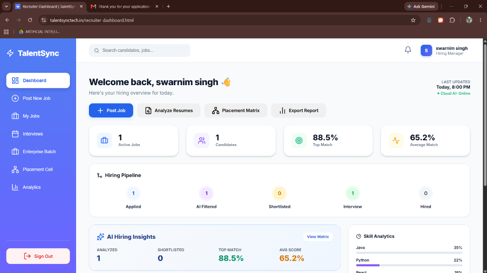
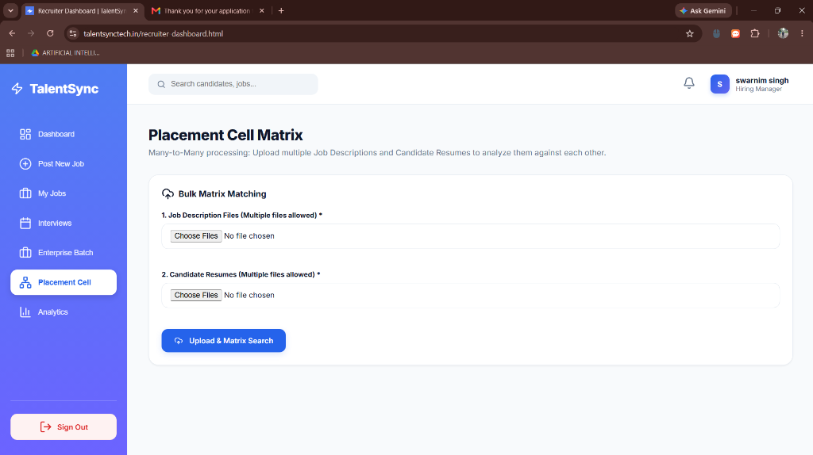
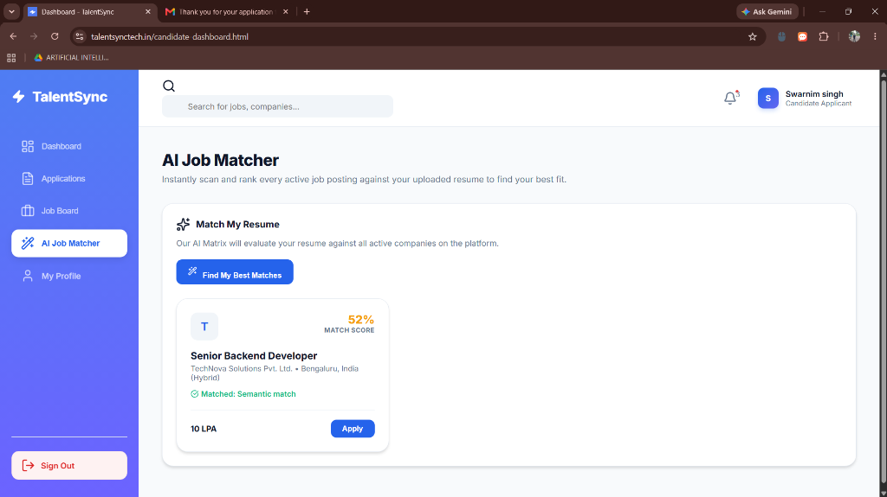
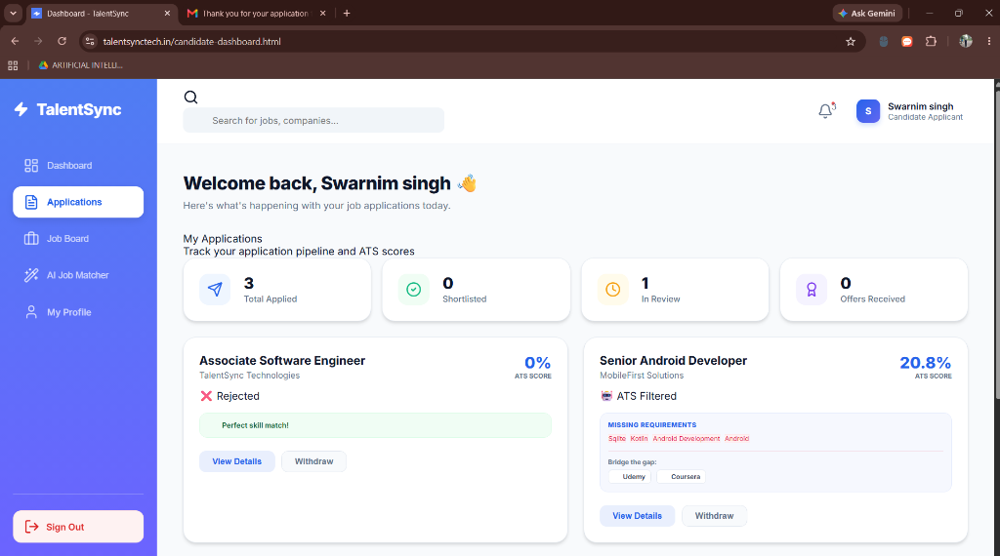
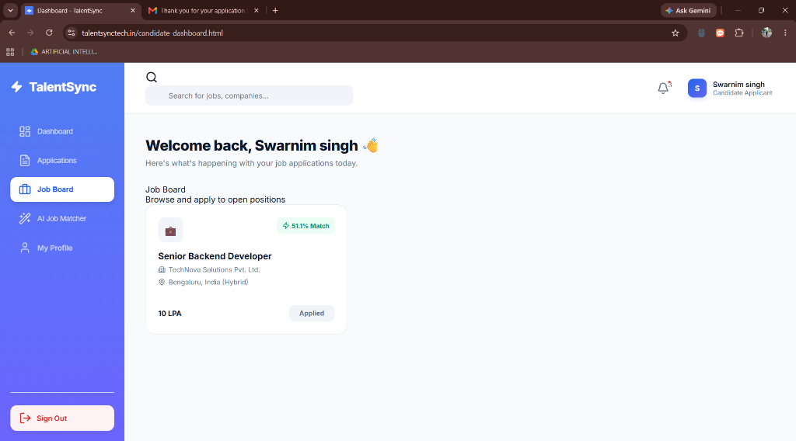
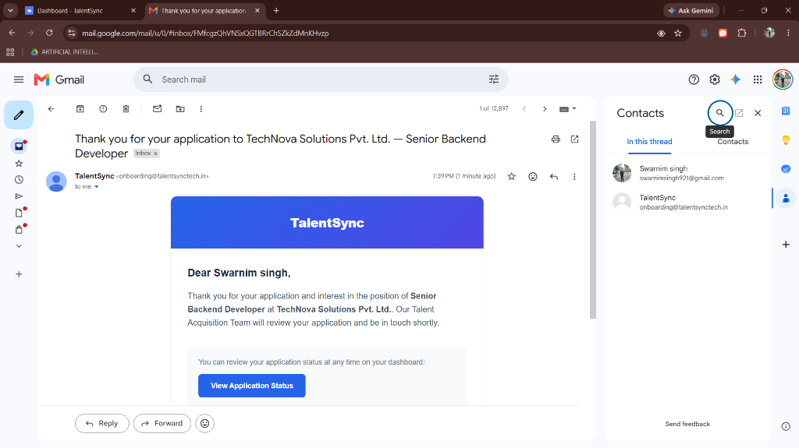
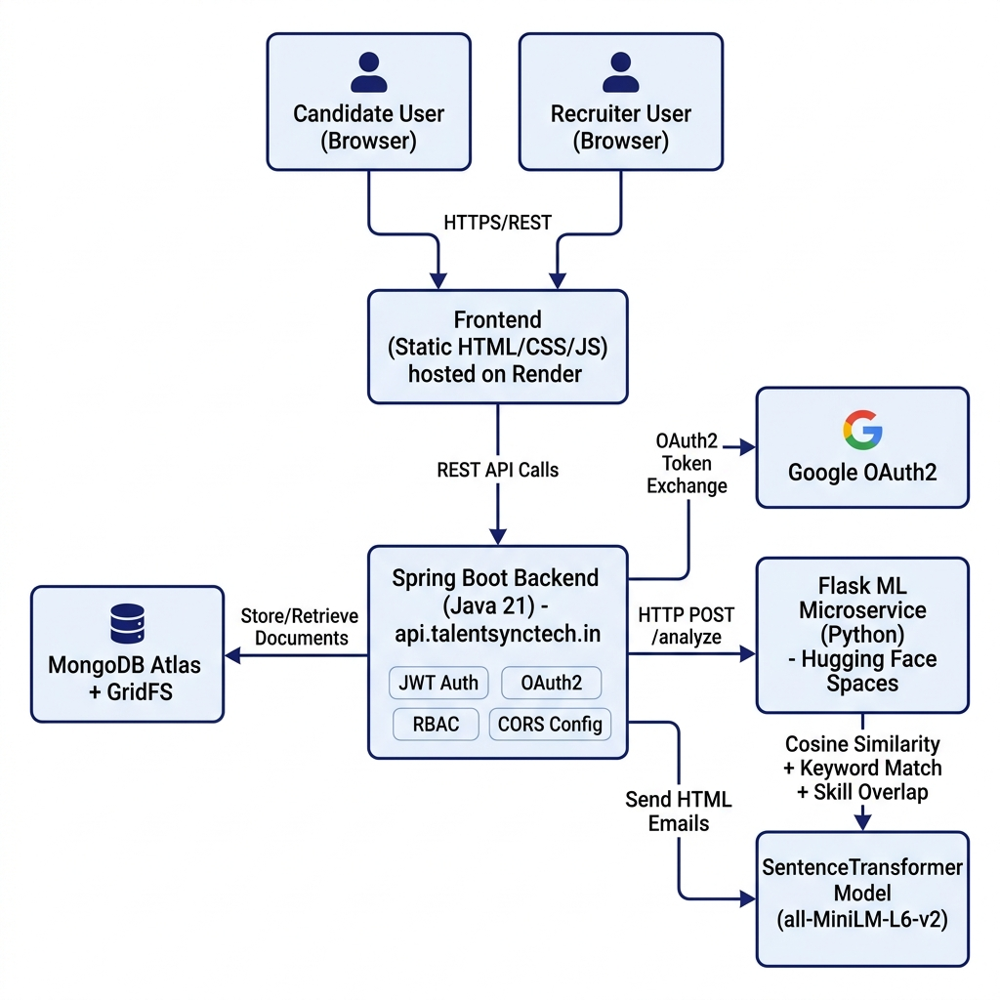
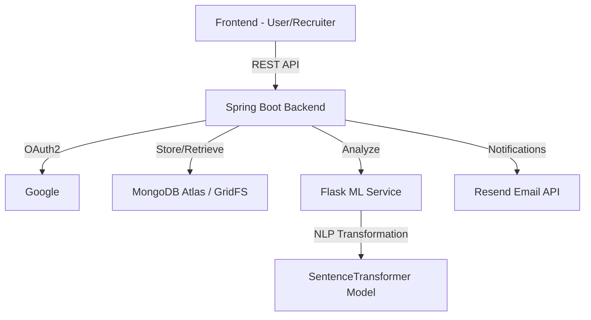

# TalentSync - AI-Powered Resume Screening & Recruitment

 

**TalentSync** is a full-stack AI recruitment platform that automates resume screening and candidate matching using modern NLP models.

## 🔗 Live Demo
Check out the live platform: [talentsynctech.in](https://www.talentsynctech.in)

---

## 📊 Project Highlights

- **Scalable AI Infrastructure**: Built using a microservice architecture (Spring Boot + Flask) for decoupled scalability.
- **Deep Semantic Search**: Leverages SentenceTransformers (`all-MiniLM-L6-v2`) to achieve high-accuracy matching beyond simple keyword searches.
- **Enterprise Batch Screening**: Recruiter dashboard can process hundreds of resumes instantly, compiling them into a comparative Placement Matrix.
- **Automated Hiring Pipeline**: Automatically parses resumes, scores candidates, transitions them through ATS stages, and dispatches dynamic HTML rejection emails for low-scoring applicants.
- **Production-Ready Security**: Implemented full JWT authentication, OAuth2 (Google), and robust Role-Based Access Control (RBAC).
- **Verified Deployment**: Fully functional, live platform deployed using Docker and Render.

---

## 🔄 How TalentSync Works

1.  **Resume Ingestion**: Candidate uploads a PDF resume, which is stored securely in **MongoDB GridFS**.
2.  **Text Extraction**: The backend extracts clean text and passes it to the **Python ML Microservice**.
3.  **Embedding Generation**: The ML service uses a **SentenceTransformer** model to generate 384-dimensional semantic embeddings.
4.  **Semantic Match**: The system calculates **Cosine Similarity** between the resume and job description embeddings.
5.  **Skill Gap Analysis**: AI identifies missing technical and soft skills by comparing extracted entities.
6.  **Ranking & Insights**: Recruiter dashboard automatically ranks candidates and provides detailed matching insights.

---

## 📸 Screenshots

### 1. Enterprise Recruiter Dashboard

*(Features live statistics, dynamic Hiring Pipeline funnel, AI Hiring Insights, and real-time Activity Timeline)*

### 2. Placement Matrix & Batch Screening

*(Ranks candidates against a Job Description dynamically using Cosine Similarity)*

### 3. Interview Scheduling Module

*(Automated interview panel allocation and slot management with utilization analytics)*

### 4. Candidate Experience & Workflows

*(Displays AI Resume Score, Missing Skills, and dynamically recommended Job Postings)*

*(Instantly scans and ranks every active job posting against the uploaded resume)*

*(Track application pipeline and real-time ATS filtering scores)*

*(Browse and apply to positions perfectly suited to candidate skills)*

### 5. Automated Rejection Emails

*(Professionally formatted HTML emails dispatched instantly by Spring Boot JavaMailSender when ATS match < 50%)*

---

## 🚀 Key Features

### For Candidates
*   **AI Resume Analysis**: Instant feedback on how well your resume matches a job description.
*   **Skills Gap Analysis**: Pinpoint exactly which technical and soft skills you're missing for a target role.
*   **Smart Recommendations**: Automated course suggestions (from Coursera, Udemy, etc.) to help you upskill.
*   **Role Prediction**: AI-powered prediction of your most likely job role based on your experience.

### For Recruiters (Enterprise Features)
*   **Automated Candidate Ranking**: Bulk process resumes and rank candidates based on a multi-factor match score.
*   **Placement Matrix**: Instantly compare hundreds of candidates in a dynamic grid showing Top Match and Average Match statistics.
*   **Deep Semantic Matching**: Uses SentenceTransformers (SOTA NLP) to understand context beyond simple keywords.
*   **Automated Hiring Pipeline**: Auto-rejection of candidates scoring below threshold with fully automated HTML emails sent via JavaMailSender.
*   **Real-time Activity Timeline**: View an event-driven timeline of candidate applications, AI analysis completions, and email dispatches.
*   **Automated Interview Scheduling**: Manage interview panels, allocate interviewer time slots, and track panel utilization percentages.

---

## 🛠️ Technology Stack

| Component | Technology |
| :--- | :--- |
| **Backend** | Java 21, Spring Boot 3.1.4, Spring Security, JWT, OAuth2 (Google) |
| **ML Microservice** | Python 3.10+, Flask, SentenceTransformers (`all-MiniLM-L6-v2`), PyTorch |
| **Database** | MongoDB Atlas (GridFS for resume storage, Mongo Sync for metadata) |
| **Frontend** | HTML5, CSS3 (Glassmorphism), Vanilla JavaScript, Google Fonts |
| **Infrastructure** | Docker, Jenkins/Render/Vercel Support, Resend (Email API) |

---

## 🤖 Machine Learning Pipeline

TalentSync utilizes a SOTA (State-of-The-Art) NLP pipeline to ensure deep semantic understanding of professional profiles.

**Model:** `all-MiniLM-L6-v2` (Sentence-Transformers)

1.  **Preprocessing**: Text cleaning, lemmatization, and role-specific tokenization.
2.  **Embedding Distribution**: Map resumes into a high-dimensional vector space.
3.  **Similarity Analysis**: Mathematical comparison using Cosine Similarity for context-aware matching.
4.  **Entity Extraction**: Identifying skills, experience levels, and certifications using custom NLP heuristics.

### Example API Request

**`POST /api/ml/analyze`**

```json
{
  "resumeText": "... Senior Java Developer with knowledge of Spring Boot and Docker ...",
  "jobDescription": "Looking for a cloud-native engineer expert in Kubernetes and Java"
}
```

**Response**

```json
{
  "matchScore": 78.5,
  "detectedSkills": ["Java", "Spring Boot", "Docker"],
  "skillsGap": ["Kubernetes", "Cloud Infrastructure"],
  "recommendedRoles": ["Backend Engineer", "DevOps Trainee"]
}
```

---

## 📐 System Architecture





---


## 📂 Project Structure

```text
talentsync/
├── smart-resume-backend/
├── src/main/java/
│   ├── controller/
│   ├── service/
│   ├── model/
│   └── security/
└── src/main/resources/
    └── static/
        ├── candidate-dashboard.html
        ├── recruiter-dashboard.html
        └── profile.html
├── ml-service/
│   ├── app.py
│   ├── ml_logic.py
│   └── requirements.txt
├── docs/
│   └── screenshots/
└── README.md
```

---

## 🛠️ Installation & Setup

### Prerequisites
*   Java 21 & Maven
*   Python 3.10+
*   MongoDB Atlas Account
*   Resend API Key (for emails)

### 1. ML Microservice Setup
```bash
cd ml-service
python -m venv venv
source venv/bin/activate  # On Windows: venv\Scripts\activate
pip install -r requirements.txt
python app.py
```

### 2. Backend Setup
Create an `application.properties` or set environment variables:
```properties
MONGODB_URI=your_mongodb_uri
JWT_SECRET=your_32_char_secret
GOOGLE_CLIENT_ID=your_id
GOOGLE_CLIENT_SECRET=your_secret
RESEND_API_KEY=your_key
ML_SERVICE_URL=http://localhost:5000
```
Run the application:
```bash
mvn clean package
mvn spring-boot:run
```

### 3. Run with Docker (Production Grade)
```bash
# Build and run the entire stack
docker-compose up --build
```

---

## 🔐 Security

TalentSync uses modern authentication mechanisms:
*   **JWT Based Authentication**: Secure stateless session management.
*   **OAuth2 Login**: Seamless integration with Google.
*   **Role-Based Access Control (RBAC)**: Distinct permissions for Candidates, Recruiters, and Admins.
*   **Secure Password Hashing**: Industry-standard encryption via Spring Security.

---

## 🔗 API Documentation (Key Endpoints)

| Endpoint | Method | Description |
| :--- | :--- | :--- |
| `/api/auth/signup` | POST | Register as Candidate or Recruiter |
| `/api/auth/signin` | POST | Authenticate and receive JWT |
| `/api/resumes/upload` | POST | Upload resume to GridFS |
| `/api/applications/apply` | POST | Submit application with match analysis |
| `/api/enterprise/placement` | GET | Generate Batch Placement Matrix |
| `/api/enterprise/schedule` | POST | Auto-schedule interviews for a panel |
| `/api/jobs/my-jobs` | GET | Fetch recruiter's active jobs |
| `/api/ml/analyze` | POST | (ML) Analyze resume-JD match percentage |

---

## 🌍 Deployment
*   **Backend**: Deployed on [Render](https://render.com) (Spring Boot + Docker).
*   **ML Service**: Hosted on [Hugging Face Spaces](https://huggingface.co/) via `Dockerfile.hf` (Flask Server).
*   **Frontend**: Hosted as static content or on [Vercel](https://vercel.com).

---

## 🧭 Future Roadmap

*   **AI Interview Preparation**: Automated technical question generation based on the candidate's specific missing skills.
*   **LLM Integration**: Using GPT-4/Claude for personalized resume improvement feedback (generative vs. extractive).
*   **Customizable Email Templates**: Allow recruiters to draft custom acceptance/rejection email flows.

---

## 👨‍💻 Author

**Swarnim Singh**
B.Tech — Artificial Intelligence & Machine Learning
Netaji Subhash Engineering College

[LinkedIn](https://linkedin.com/in/singhswarnim) | [GitHub](https://github.com/swarnim921)

---

## ❤️ Acknowledgments

Special thanks to the following communities and tools:
- **Sentence-Transformers (UKPLab)** for the embedding models.
- **Hugging Face** for the model ecosystem.
- **Spring & Flask Communities** for the robust frameworks.
- **MongoDB** for the excellent GridFS support.

---

## 📄 License
This project is licensed under the MIT License - see the LICENSE file for details.