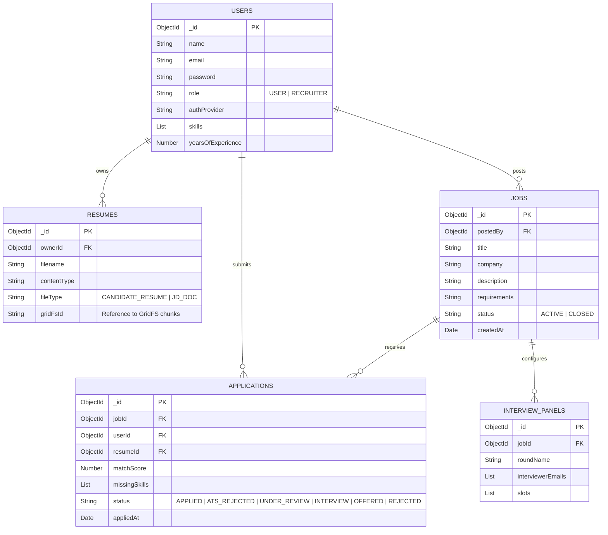
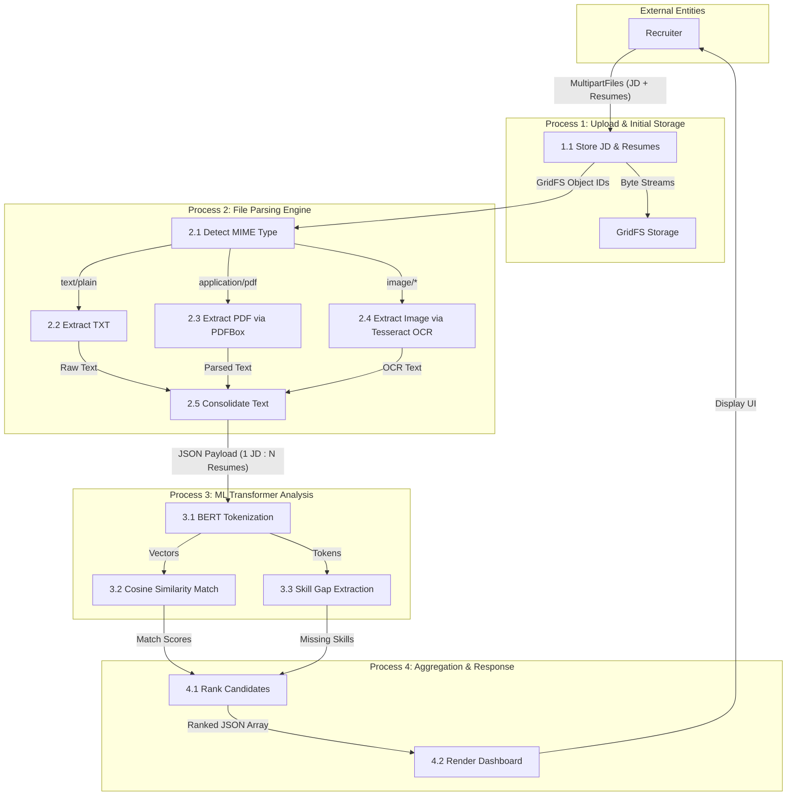

# TalentSync Architecture Diagrams

As requested by the mentor, here are the architectural diagrams outlining the system's database structure, data flow, and workflow models. These diagrams utilize Mermaid.js.

## 1. Database Diagram (DBD)

The Database Diagram outlines the primary entities stored in MongoDB and their relationships. Since MongoDB is NoSQL, these relationships represent logical links (e.g., ObjectIds) rather than strict foreign keys.

## 2. Data Flow Diagram (DFD Level 3) - Enterprise Batch Screening

This Level 3 DFD illustrates the deep technical flow of data during the B2B Many-to-1 resume screening process.

## 3. Workflow Block Diagram - Many-to-1 Processing

This diagram shows the high-level workflow of the system from a user's perspective, highlighting the B2B Service aspect.

```mermaid
flowchart LR
    Start([Recruiter Logs In]) --> Auth{Authenticated?}
    Auth -- No --> Login(Redirect to Login)
    Auth -- Yes --> Dash(Recruiter Dashboard)
    
    Dash --> Tab(Select 'Enterprise Batch' Tab)
    Tab --> UploadJD[Upload Primary Job Description File]
    UploadJD --> UploadRes[Upload Batch of N Resumes]
    
    UploadRes --> Run(Click 'Run Batch Screening')
    
    subgraph "TalentSync Core API"
        Run --> ParseJD(Parse JD File)
        ParseJD --> ParseRes(Parse N Resume Files)
        ParseRes --> SendML(Dispatch Payload to ML Microservice)
    end
    
    subgraph "Python ML Service"
        SendML --> Analyze(Deep Learning Transformer Model)
        Analyze --> Rank(Sort Candidates by Fit)
    end
    
    Rank --> ReturnData(Return Ranked Array to Frontend)
    
    ReturnData --> DisplayUI{Are Candidates Parsed?}
    DisplayUI -- Yes --> ShowTable(Display Interactive Ranking Table)
    ShowTable --> End([End Workflow])
```

